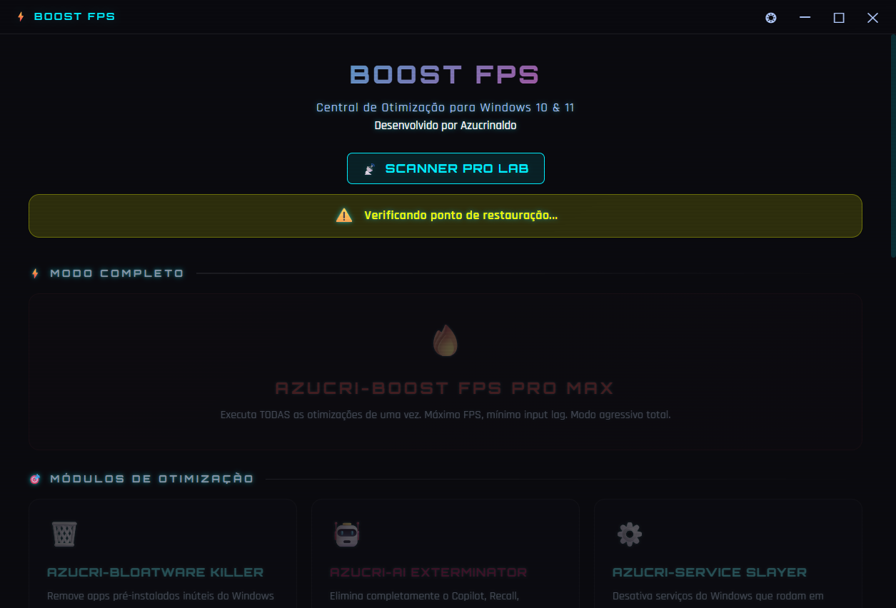
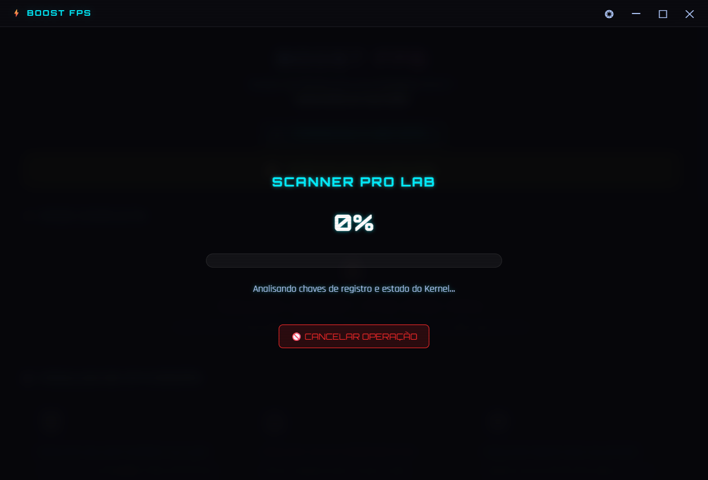
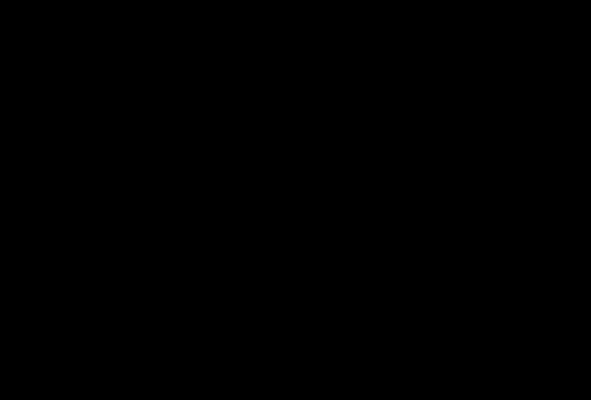

# ⚡ Azucrinaldo - BOOST FPS

<div align="center">
  
  
  
</div>

---

## 🚀 O que é o BOOST FPS?

O **BOOST FPS** é uma central de otimização Windows ultravisível, projetada para jogadores competitivos que buscam a menor latência possível e a máxima estabilidade de quadros. Desenvolvido com uma estética **Cyberpunk**, o app automatiza centenas de ajustes técnicos que normalmente levariam horas para serem feitos manualmente.

### 🎥 Preview da Interface
<div align="center">
  <table>
    <tr>
      <td width="50%">
        
        <p align="center"><i>Dashboard Principal - Interface Real</i></p>
      </td>
      <td width="50%">
        
        <p align="center"><i>Scanner Pro Lab - Interface Real</i></p>
      </td>
    </tr>
    <tr>
      <td colspan="2" align="center">
        
        <p align="center"><i>Introdução e Visual Cinematográfico Real</i></p>
      </td>
    </tr>
  </table>
</div>

---

## 📥 Download e Instalação

Para facilitar o acesso, você pode baixar a versão mais recente pronta para uso:

[](https://github.com/Azucrinaldo/FPS-BOOST/releases/latest)

> [!NOTE]
> Se o link acima ainda não estiver ativo, você pode encontrar o executável na pasta `dist/` após realizar o [build manual](#-desenvolvimento-e-build).

---

## 🛠️ Detalhes técnicos e Comandos Script

O coração do Azucrinaldo BOOST FPS são scripts PowerShell altamente otimizados. Abaixo, detalhamos as principais categorias de comandos executados:

| Categoria | Comandos Principais | O que faz no sistema? |
| :--- | :--- | :--- |
| **🗑️ Bloatware** | `Get-AppxPackage` / `Remove-AppxPackage` | Remove apps inúteis da MS que consumem RAM e CPU. |
| **🤖 IA Exterminator** | `Set-ItemProperty` (Registry) | Desativa Copilot e Recall para evitar capturas de tela e monitoramento. |
| **⚙️ Services** | `Set-Service -Status Stopped` | Desliga o Superfetch e Indexação de disco para evitar micro-stutters. |
| **🌐 Net Booster** | `netsh int tcp set global` | Desativa algoritmos de throttling e Nagle para reduzir o Ping. |
| **☢️ Kernel/Extreme** | `bcdedit /set ...` | Ajusta o Timer Resolution e desativa mitigações Spectre/Meltdown. |

---

## 🛡️ Segurança: Azucri-RollBack

Nós levamos sua estabilidade a sério. O app possui um sistema de segurança de duas camadas:
1. **Ponto de Restauração Forçado**: O app não inicia sem confirmar a existência de um backup do sistema.
2. **Logs Transparentes**: Cada mudança no registro ou serviço é registrada em tempo real para auditoria.

---

## 🏗️ Desenvolvimento e Build

Se você deseja contribuir ou compilar o projeto do zero:

```bash
# Clone o repositório
git clone https://github.com/Azucrinaldo/FPS-BOOST.git

# Instale as dependências
npm install

# Inicie em modo dev
npm run dev

# Gere o executável (.exe)
npm run build
```

---

## 👨‍💻 Créditos

Desenvolvido por **Azucrinaldo** com ❤️ para a comunidade gamer brasileira.

---
*Aviso Legal: Modificações de registro e kernel podem ser arriscadas. Use sempre o sistema de backup integrado.*
